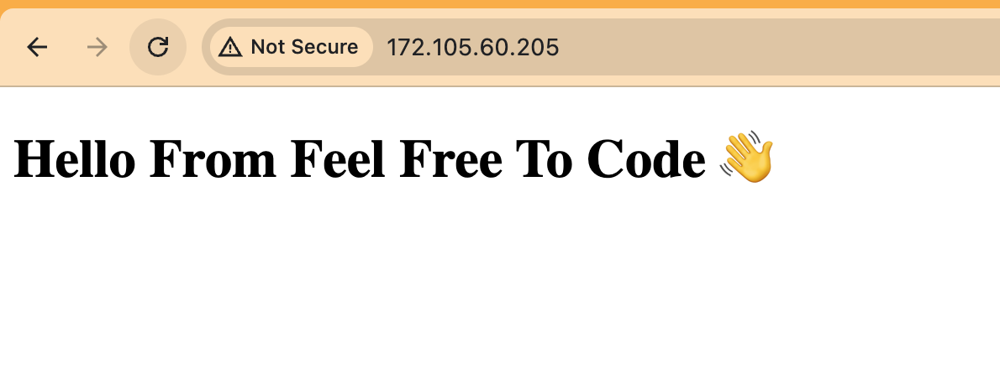

🎉 Change HTML of Nginx 🎉

Step 1: Open the Default Configuration File 📝

```bash
sudo nano /etc/nginx/sites-available/default
```

Step 2: Replace the Content & Save 📂

```bash
server {
	listen 80 default_server;
	listen [::]:80 default_server;


	server_name feelfreetocode;
	root /var/www/feelfreetocode;
	index index.html index.htm index.nginx-debian.html;

	location / {
		# First attempt to serve request as file, then
		# as directory, then fall back to displaying a 404.
		try_files $uri $uri/ =404;
	}
}
```

Step 3: Navigate to the `/var/www` Directory 🧭

```bash
cd /var/www
```

Step 4: Create the feelfreetocode Folder 📁
Create a folder named feelfreetocode to match the configuration:

```bash
sudo mkdir feelfreetocode
```

You’ve just built a new home for your website’s files!

Step 5: Create an index.html File ✍️

Navigate into the feelfreetocode folder and create a file named index.html:

```bash
sudo nano index.html
```

This is where your website’s main page will live.

Step 6: Add Some HTML Content 🌟

Add the following HTML content to the index.html file:

```html
<!DOCTYPE html>
<html lang="en">
  <head>
    <meta charset="UTF-8" />
    <meta name="viewport" content="width=device-width, initial-scale=1.0" />
    <title>Feel Free To Code</title>
  </head>
  <body>
    <h1>Hello From Feel Free To Code 👋</h1>
  </body>
</html>
```

This is the greeting your visitors will see. How cool is that?

Step 7: Test the Nginx Configuration 🛠️

Before we launch, let's make sure everything is set up correctly. Run:

```bash
sudo nginx -t
```

This is like a dress rehearsal to make sure there are no errors.

Step 8: Reload Nginx 🔄

If everything is good, let’s reload Nginx to apply the changes:

```bash
sudo systemctl reload nginx
```

Nginx is now updated with your new configuration!

Step 9: Visit Your Server in the Browser 🌐

Open your web browser and navigate to your server’s IP address. You should see your custom "Hello From Feel Free To Code" page. 🎉



Congratulations! You’ve successfully configured Nginx to serve your custom content. Enjoy your newly configured server and happy coding! 🥳
