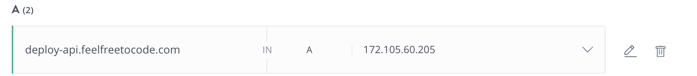
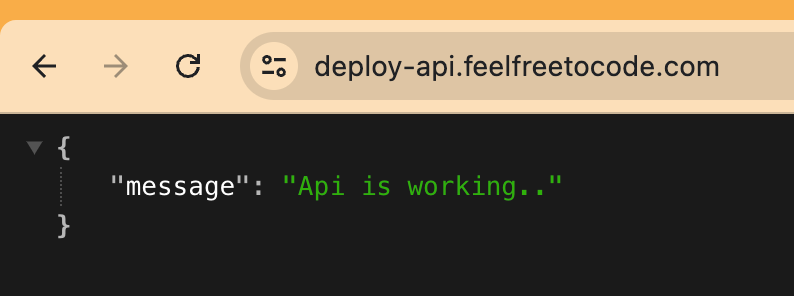

# 🌐 Setting Up SSL for Nginx on Ubuntu with Certbot

🛠️ 1. Install Certbot and the Nginx Plugin
First, install Certbot and the Nginx plugin using the following command:

```bash
sudo apt install certbot python3-certbot-nginx
```

⚙️ 2. Configure Nginx
Edit your Nginx configuration file to include your server name. Open the file with a text editor:

```bash
sudo vim /etc/nginx/sites-available/default
```

Add your subdomain in the server_name directive:

```nginx
server {
...
server_name deploy-api.feelfreetocode.com;
...
}
```

Save the file 💾 and exit the editor. Then, test your Nginx configuration:

```bash
sudo nginx -t
```

🌍 3. Create an A Record in Your Domain Registrar
Log in to your domain registrar (e.g., GoDaddy) and create an A record pointing to the IP address of your server 🖥️.

Record Type: A
Name: deploy-api.feelfreetocode.com
Value: IPv4 address of the server



🔑 4. Obtain an SSL Certificate

Run Certbot to obtain an SSL certificate for your subdomain:

```bash
sudo certbot --nginx -d deploy-api.feelfreetocode.com
```

Follow the prompts:

Enter the email address associated with your domain registrar account ✉️.
Accept the terms of service ✅.
Press Enter to continue.
Certbot will automatically configure your Nginx to use the new certificate. You should see a message indicating that the certificate was successfully issued 🏆.

🌐 5. Access Your Site
You can now access your site using HTTPS:

```bash
https://deploy-api.feelfreetocode.com
```

🎉 Congratulations! Your site is now secured with SSL.

🔄 6. Renewing the Certificate

To check if the certificate is close to expiring, run:

```bash
sudo certbot renew --dry-run
```

To renew the certificate, run:

```bash
sudo certbot renew
```

This guide ensures that your Nginx server is secured with SSL, making your site accessible over HTTPS 🔒🌐.


