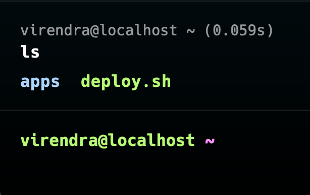

# 🚀 CI/CD Pipeline Setup for Next.js Project

This guide will walk you through setting up a CI/CD pipeline using GitHub Actions to automatically deploy your Next.js project to a self-hosted server.

## 1. 📝 Create a Deployment Script

First, we need a script on your server that handles the deployment.

1. Create the script:

On your server, create a file named `deploy.sh`.

Add the following content:

```bash
# Variables
APP_DIR=/var/www/your-nextjs-app
GIT_REPO=git@github.com:your-username/your-repo.git # your ssh git url

# Navigate to the app directory
cd $APP_DIR

# Pull the latest changes
# assuming you already cloned the project
git pull $GIT_REPO

# Install dependencies
npm install

# Build the project
npm run build

# Restart the app using PM2
# Check for the name using `pm2 list`
pm2 restart <APP-NAME>
```

2. Make the script executable:

Run the following command to make sure the script can be executed:

```bash
chmod +x /path/to/deploy.sh
```

This command changes the script’s permissions, allowing it to be executed.

## 2. 🔑 Set Up SSH Key for GitHub Actions

You need to set up SSH keys to allow GitHub Actions to access your server securely.

Generate an SSH key on your server:

Run this command on your server:

```bash
ssh-keygen -t ed25519 -C "github-actions-deploy"
```

When prompted, press Enter to save the key to the default location and leave the passphrase empty.
This generates a new SSH key pair, with the private key stored in ~/.ssh/id_ed25519.

Add the SSH key to your server's authorized keys:

Append the public key to the authorized_keys file:

```bash
cat ~/.ssh/id_ed25519.pub >> ~/.ssh/authorized_keys
```

This command allows the SSH key to authenticate access to your server.

Add the private key to GitHub Secrets:

- Go to your GitHub repository.
- Navigate to Settings > Secrets and variables > Actions.
- Click on New repository secret and add a secret named SSH_PRIVATE_KEY.
- Paste the content of the private key from ~/.ssh/id_ed25519.
- This allows GitHub Actions to use the SSH key for deployments.

## 3. 🔄 Create a GitHub Actions Workflow

Now, let’s set up the workflow that will handle the CI/CD process.

1. Create the workflow file:

In your repository, create a new file at .github/workflows/deploy.yml.

Add the following content:

```yaml
name: 🚀 Deploy Next.js App

on:
  push:
    branches:
      - main # Trigger on push to the main branch

jobs:
  deploy:
    runs-on: ubuntu-latest

    steps:
      - name: Checkout code
        uses: actions/checkout@v3

      - name: Set up Node.js
        uses: actions/setup-node@v3
        with:
          node-version: "16"

      - name: Install dependencies
        run: npm install

      - name: Build the project
        run: npm run build

      - name: Deploy to server via SSH
        uses: appleboy/ssh-action@v0.1.6
        with:
          host: ${{ secrets.SERVER_IP }} # Add SERVER_IP as a GitHub secret
          username: ${{ secrets.SERVER_USER }} # Add SERVER_USER as a GitHub secret
          key: ${{ secrets.SSH_PRIVATE_KEY }}
          script: |
            ./deploy.sh
```

In my case `deploy.sh` is in root that is why i will use `./deploy.sh` in script , this can be any path



This workflow will automatically deploy your Next.js app whenever you push to the main branch.

2. Configure GitHub Secrets:

- Add the following secrets in your repository settings:
  - `SERVER_IP`: Your server’s IP address.
  - `SERVER_USER`: The SSH username to access your server.

## 4. ✅ Trigger the CI/CD Pipeline

- Push your code:

  - Push changes to the main branch to trigger the CI/CD pipeline automatically.

- Monitor the Workflow:
  - Go to the "Actions" tab in your GitHub repository to check the status of the deployment.
