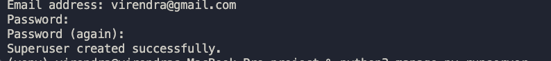
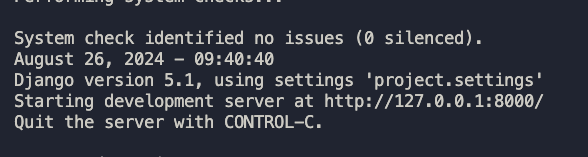
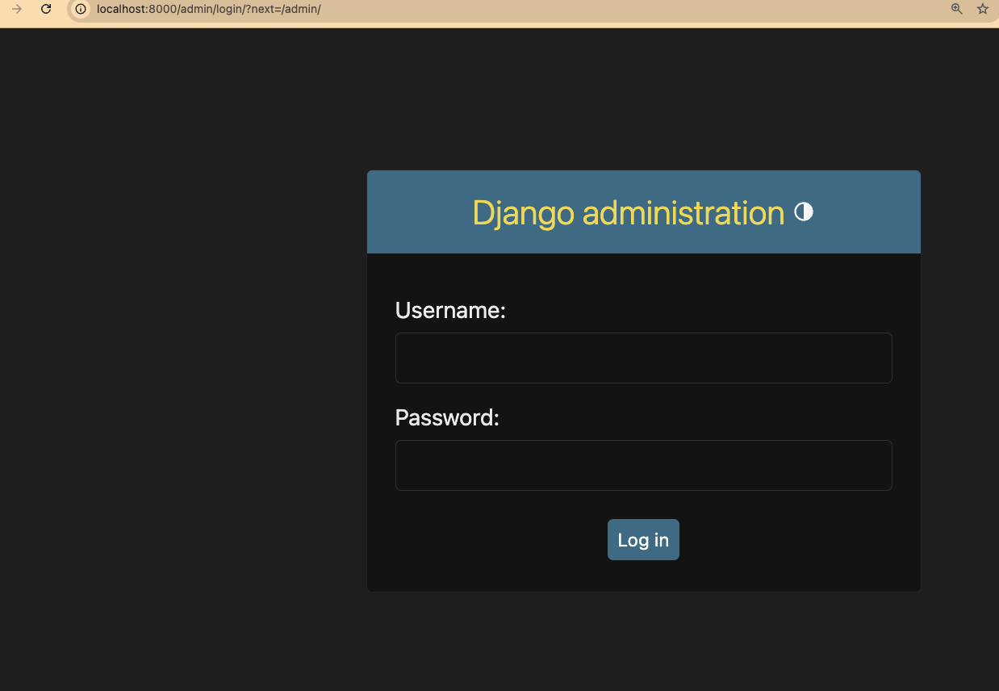
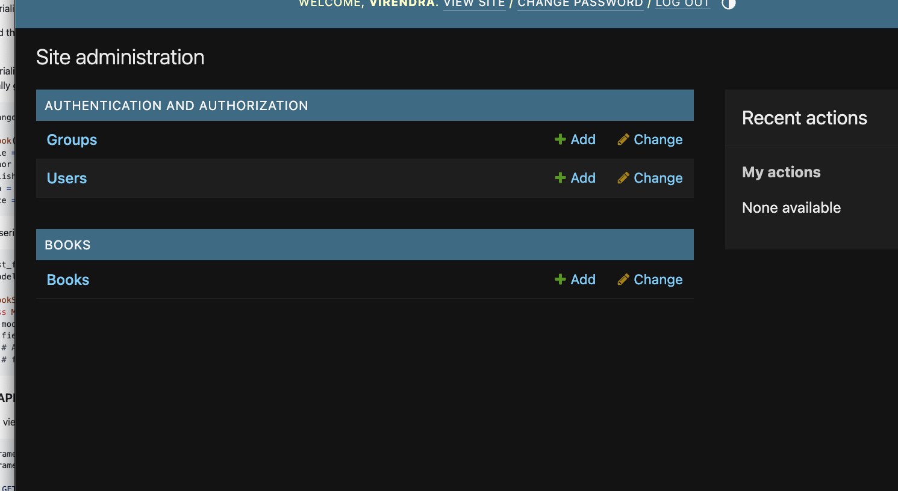
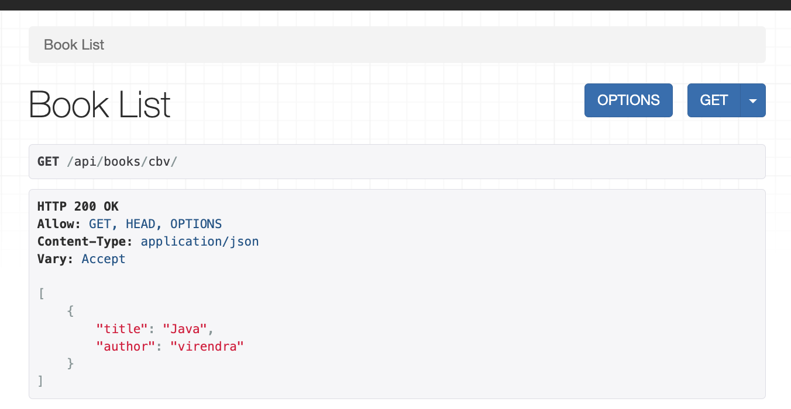
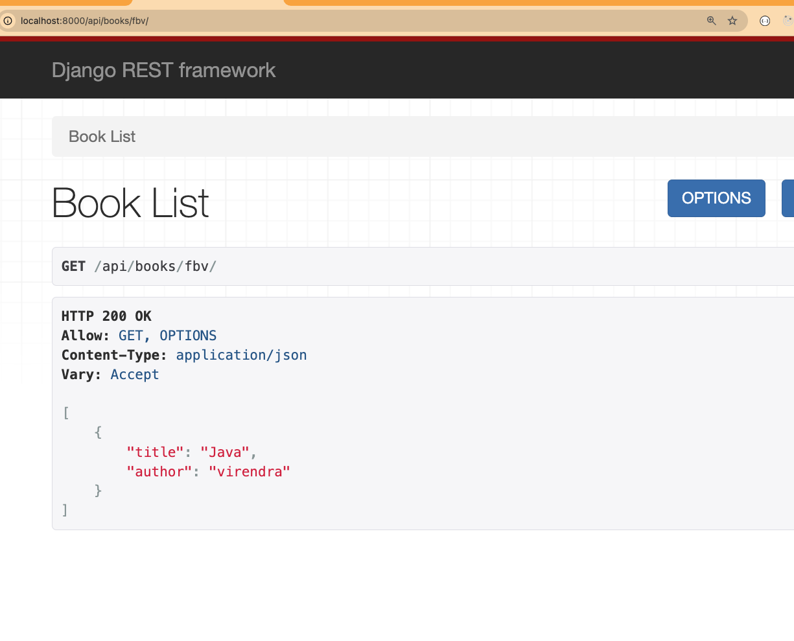

# Introduction and Basic Setup

### Overview of DRF

- Whats is Django Rest Framework?

  Understand that Django Rest Framework (DRF) is a powerful and flexible toolkit for building Web APIs in Django.

- Why use DRF?

  Learn about the benefits, such as robust serialization, authentication, and easy integration with Django models.

- Core Concepts

  Get an overview of the core components like Serializers, Views, ViewSets, Routers, and more.

### Setting Up Django Project with DRF

- Installing Django and DRF

  Set up a virtual environment and install Django and DRF using pip

  ```bash
  pip install django djangorestframework
  ```

- Creating a New Django Project

  Use django-admin startproject to create a new Django project.

  ```bash
  django-admin startproject myproject
  ```

- Adding DRF to Installed Apps

  In settings.py, add 'rest_framework' to the INSTALLED_APPS list.

  ```python
      INSTALLED_APPS = [
        ...
        'rest_framework',
      ]
  ```

- Create an app

  ```bash
    cd myproject
    django-admin startapp books
  ```

- Add to INSTALLED_APPS

  ```python
      INSTALLED_APPS = [
        ...
        'rest_framework',
        'books'
      ]
  ```

### Understanding Serializers

- What is a Serializer?

- Learn how serializers are used to convert complex data types like Django models into JSON and vice versa.

- Creating a Simple Serializer

- Start by creating a basic serializer for a Django model. For example, if you have a Book model:

add the code to books/serializers.py

```python
from rest_framework import serializers
from .models import Book
    class BookSerializer(serializers.Serializer):
        title = serializers.CharField(max_length=100)
        author = serializers.CharField(max_length=100)
```

- Using ModelSerializer

- Understand the difference between a basic serializer and a ModelSerializer, which provides a shortcut for serializing Django models.

- A ModelSerializer in Django REST Framework (DRF) is a shortcut for creating serializers that deal with Django models. It automatically generates fields and validators based on the model you specify.

add the code to books/models.py

```python
from django.db import models

class Book(models.Model):
    title = models.CharField(max_length=100)
    author = models.CharField(max_length=100)

```

Serializer (serializers.py)

```python
from rest_framework import serializers
from .models import Book

class BookSerializer(serializers.ModelSerializer):
    class Meta:
        model = Book
        fields = '__all__'
        # Alternatively, you can specify fields explicitly:
        # fields = ['title', 'author', 'published_date', 'isbn', 'price']
```

### Creating Basic API Views

- Function based views

```python
from rest_framework.decorators import api_view
from rest_framework.response import Response

@api_view(['GET'])
def book_list(request):
    books = Book.objects.all()
    serializer = BookSerializer(books, many=True)
    return Response(serializer.data)
```

- Class-Based Views (CBVs)

  ```python
  from rest_framework.views import APIView

  class BookList(APIView):
      def get(self, request):
          books = Book.objects.all()
          serializer = BookSerializer(books, many=True)
          return Response(serializer.data)
  ```

- Complete view code with both the views doing same task

```python
from django.shortcuts import render
from .serializers import BookSerializer
from .models import Book

from rest_framework.decorators import api_view
from rest_framework.response import Response
from rest_framework.views import APIView


@api_view(['GET'])
def book_list(request):
    books = Book.objects.all()
    serializer = BookSerializer(books, many=True)
    return Response(serializer.data)

class BookList(APIView):
    def get(self, request):
        books = Book.objects.all()
        serializer = BookSerializer(books, many=True)
        return Response(serializer.data)

```

- Add urls

Change the urls.py inside app, create file if does not exist

```python
from django.contrib import admin
from django.urls import path
from .views import book_list, BookList

urlpatterns = [
    path('fbv/', book_list),
    path('cbv/', BookList.as_view()),
]
```

Change the project's urls.py

```python
from django.contrib import admin
from django.urls import path, include

urlpatterns = [
    path('admin/', admin.site.urls),
    path('api/books/', include('books.urls')),
]

```

- Create a superuser to add some books

```bash
python3 manage.py createsuperuser
```



- Make migrations

```bash
python3 manage.py makemigrations
python3 manage.py migrate
```

- Register the models to admin site

```python
from django.contrib import admin
from .models import Book

# Register your models here.

admin.site.register(Book)
```

- Run the server

```bash
python3 manage.py runserver
```

`Visit localhost:8000/admin`





Login with the super user



- Create some books

- Hit the api end point

`http://localhost:8000/api/books/cbv/`



`http://localhost:8000/api/books/fbv/`



These steps provide a strong foundation, introducing you to the key concepts and basic setup of Django Rest Framework. You’ll start building simple APIs using function-based and class-based views, giving you practical experience with DRF right from the start.
